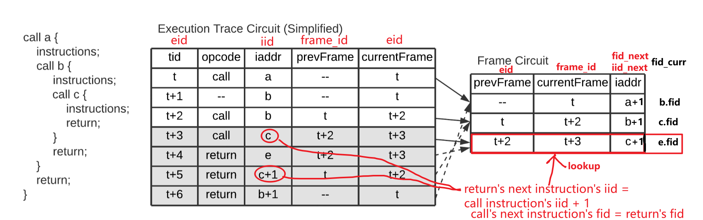
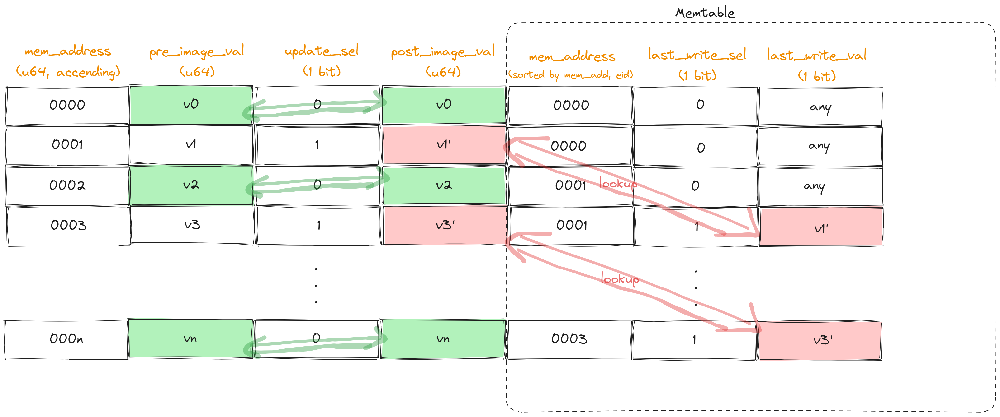

# Understanding zkWasm's Circuit layout
In zkWasm, the arrangement of each instruction's related states occupies **4 rows** within the circuit table, defined as `instruction_rows`. Constraints are established within these four rows and between successive instruction_rows. See the code [here](./crates/zkwasm/src/circuits/etable/mod.rs#L219).

| U32_Advice_Col | U32_Advice_Col | U64_Advice_Col | Bit_Advice_Col | …         | Bit_Advice_Col | U8_Advice_Col | … |
|----------------|----------------|----------------|----------------|-----------|----------------|---------------|---|
| curr_eid       | …              | …              |    ...         | GlobalGet | Select         |   ...         |   |
|   frame_id   | …              | …              | LocalGet       | GlobalSet | Return         |   ...         |   |
| …              | …              | …              | LocalSet       | Const     | Bin            |   ...         |   |
| …              | …              | …              | LocalTee       | Drop      | Unary          |   ...         |   |
| next_eid       | …              | …              |    ...         | ... | 
| next_frame_id  | …              | …              |    ...         | ... | 

While zkWasm employs Halo2's API, it defines a custom circuit layouter with three main differences from Halo2:

- Column Type Bounds: Each column is bound by a range constraint. This includes BitColumn, CommonRangeColumn (ranging from 0 to 1 << zkwasm_k() - 1), U16Column, U32Column, U64Column, JTableLookup, MTableLookup, etc. For ease of reference later, we collectively refer to all these columns as `TypeColumn`.

- Gate Constraint Building: Constructing gate constraints involves querying related cells and creating gates. To query a cell, an `alloc` function is utilized to obtain an unused cell of a TypeColumn within the current instruction_rows (akin to a conceptual region in Halo2). Moreover, after allocating one cell, the subsequent cell of the same type will be assigned to the next cell in that column. If allocation extends beyond the fourth row, allocation restarts from the first row of the subsequent column of the same type (See [code](./crates/zkwasm/src/circuits/etable/allocator.rs#L335)). The code utilizes a BTreeMap named `free_cells` to record the allocation of each type of cell up to which column's first row. When creating gates for an instruction, a `constraint builder` is encapsulated (e.g., integer addition [here](./crates/zkwasm/src/circuits/etable/op_configure/op_bin.rs#L168)) and then [`finalized`](./crates/zkwasm/src/circuits/etable/constraint_builder.rs#L61) to call Halo2's create gate API.

- Lookup: During a lookup, zkWasm encodes cells to be looked up into an auxiliary cell and constrains the encoding equation. Then, it looks up the auxiliary cell in another table's encoded cell. An example is the `op_br` instruction's `encode_memory_table_entry`.

For instance, let's consider `etable`. A `log_cell` macro has been integrated into the etable code to log the location of cells by their col and row.

After running the following simple test case, the cell's Column and Rotation will be printed.
```
cargo test test_uniform_verifier -- --show-output
```

# Instruction Circuits
## Numeric Instructions: `i32.Add`
The i32.Add instruction in WebAssembly is a typical binary operation `binop`([wasm spec](https://webassembly.github.io/spec/core/exec/instructions.html#t-mathsf-xref-syntax-instructions-syntax-binop-mathit-binop)). zkWasm's implementation of `Call` is [here](https://github.com/DelphinusLab/wasmi/blob/99157e5054d3559a89843890faefca01d1bf8444/src/runner.rs#L2716). Its execution involves several steps:

1. Pop the value lhs from the stack.
2. Pop the value rhs from the stack.
3. Compute the result res = lhs + rhs.
4. Push the value res onto the stack.

The constraints associated with this operation are defined by mathematical equations and rules to ensure correct execution within the WebAssembly framework. These constraints can be summarized as follows:

1. Mathematical Equation Constraint:
    `lhs + rhs − res + isoverflow * 1<<32 = 0`
    This equation ensures that the arithmetic operation is correct even when overflow happens.  The `add gate` circuit is defined [here](./crates/zkwasm/src/circuits/etable/op_configure/op_bin.rs#L168).

2. Instruction Address Constraint:
    `iaddr.curr + 1 − iaddr.next = 0`.
    - This constraint manages the flow of instructions within the WebAssembly execution and maintain the order of operations. 
    - The circuits pertaining to the stack pointer (`sp`) and instruction addresses (`iaddr`) in zkwasm are situated within the same context as [other instructions](./crates/zkwasm/src/circuits/etable/mod.rs#L491). 
    - The `iaddr` tuple comprises the modular ID (`moid`), memory block instance ID (`mmid`), function ID (`fid`), and instruction offset within a specific function (`iid`). Given that `moid` and `mmid` remain constant, only [`fid` and `iid` are constrained](./crates/zkwasm/src/circuits/etable/mod.rs#L542) within zkwasm to ensure the proper execution flow and adherence to WebAssembly's specifications.

3. Stack Pointer Constraint:
    `sp.curr + 1 - sp.next = 0`
    As the WebAssembly stack grows downwards, these constraints handle the stack pointer adjustments after popping or pushing values onto the stack.

4. Memory Table Constraints:
    ```
    Plookup(MemoryTable, (StackType, read, sp.curr + 1, rhs)) = 0
    Plookup(MemoryTable, (StackType, read, sp.curr + 2, lhs)) = 0
    Plookup(MemoryTable, (StackType, write, sp.curr + 2, res)) = 0
    ```
    - These constraints ensure proper memory table lookups and operations related to the stack values involved in the `i32.Add` instruction. 
    - Note that the stack pointer for the resulting value `res` is determined as `sp.curr + 2`. This adjustment is due to the nature of WebAssembly's stack, which **grows downwards**. Consequently, when an item is popped from the stack, the stack pointer effectively decreases by 1. 
    - This behavior is reflected in the [implementation of the WebAssembly interpreter](./third-party/wasmi/wasmi_v1/src/engine/value_stack.rs#L186). Circuit for 3 Plookups's encoded cells for lookup are defined [here](./crates/zkwasm/src/circuits/etable/op_configure/op_bin.rs#L106) 

These configurations and constraints collectively ensure the correct handling of binary operations, including i32.Add, within the zkwasm framework, aligning with WebAssembly's stack behavior and execution requirements.

## Control Flow Instructions: `Call` and `Return` 

### `Call` instruction
Wasm's `Call` instruction [spec](https://webassembly.github.io/spec/core/exec/instructions.html#xref-syntax-instructions-syntax-instr-control-mathsf-call-x) is simple, zkWasm's implementation of `Call` is [here](https://github.com/DelphinusLab/wasmi/blob/99157e5054d3559a89843890faefca01d1bf8444/src/runner.rs#L2127).  It involves 3 constraints:



1. Instruction Address Constraint:
    `iaddr.curr − iaddr.next = 0`
    This makes sure that the next instruction addr is call instruction's target jump addr. This constrain involves [`next_fid` and `next_iid` function](./crates/zkwasm/src/circuits/etable/op_configure/op_call.rs#L113), [`fid change` gate and `iid change` gate](./crates/zkwasm/src/circuits/etable/mod.rs#L542).

2. Stack Pointer Constraint:
    `sp.curr - sp.next = 0`
    This ensures there is no stack change. This constrain is [implemented](.crates/zkwasm/src/circuits/etable/mod.rs#L491) along with other instructions. 

3. Call Frame Constraint:
    `eid.curr - frame_id.next = 0`
    This ensures the following instruction's previous call frame is the current call frame. This constrain involves [`next_frame_id` function](./crates/zkwasm/src/circuits/etable/op_configure/op_call.rs#L113) and [`frame_id change` gate](./crates/zkwasm/src/circuits/etable/mod.rs#L568).

4. Frame Table Constraints:
    ```
    Plookup(FrameTable, (
        eid: currentFrame, 
        frame_id_cell: prevFrame, 
        index_cell: iaddr.next.fid, 
        fid_cell: iaddr.curr.fid, 
        iid_cell: iaddr.curr.iid + 1)
    )
    ```
    This helps us to find out the next `iaddr` of `Return` instruction, which should be offset by 1 compared to that of current `Call` instruction. Also, it constrains that `Call` instruction's next instruction should be in the same call frame with the corresponding `Return instruction`.
    And, the corresponding lookup constraint is [here](./crates/zkwasm/src/circuits/etable/op_configure/op_call.rs#L43). 

### `Return` instruction

Wasm's `Return` instruction [spec](https://webassembly.github.io/spec/core/exec/instructions.html#xref-syntax-instructions-syntax-instr-control-mathsf-return) is a bit more complicated compared to `Call`. Especially, wasm current doesn't support multiple returns. Follow zkWasm interpreter's [`Return` implementation](https://github.com/DelphinusLab/wasmi/blob/99157e5054d3559a89843890faefca01d1bf8444/src/runner.rs#L2062), `self.value_stack.drop_keep(drop_keep)` is the most important part. So, according to the implementation, `Return` involves the following constraints:

```
| prev call frame  |
| curr call frame  |  <-- write 1 kept value to next call frame (sp + drop + 1)
|  - arg 1         |        |
|  - arg 2         |        |
+------------------+        |
| callee locals    |        | <-- the number of dropped values is `drop`
|  - var 1         |        |
|  - var 2         |        |
+------------------+        |
| operands         |        |
|  - op 1          |        |
|  top value       |  <-- kept value (sp + 1)
|  return          |  <-- current stack pointer (sp)
+------------------+
```

1. MemoryTable Read Constraint:
    `Plookup(MemoryTable, (StackType, sp.curr + 1, return_value)) keep = 0`. 
    The above constrain is enabled when `keep = 1`, which means the **top** value will be kept before "discarding" the current stack frame. The circuit of encoded cell for lookup is defined [here](./crates/zkwasm/src/circuits/etable/op_configure/op_return.rs#L62).

2. MemoryTable Write Constraint:
    `Plookup(MemoryTable, (StackType, sp.curr + 1, return_value)) keep = 0`. 
    The above constrain is enabled when `keep = 1`. This ensures the kept value written to top of the next stack frame. The circuit of encoded cell for lookup is defined [here](./crates/zkwasm/src/circuits/etable/op_configure/op_return.rs#L72).

3. FrameTable Constraint:
    This ensures `Return` instruction finds the correct `next` instruction. It's the same as the corresponding `Call` instruction. The circuit of encoded cell for lookup is defined [here](./crates/zkwasm/src/circuits/etable/op_configure/op_return.rs#L83)

## Memory (Stack, Global) Instructions: Heap `load` 

Wasm's heap load instruction specification can be found [here](https://webassembly.github.io/spec/core/exec/instructions.html#t-mathsf-xref-syntax-instructions-syntax-instr-memory-mathsf-load-xref-syntax-instructions-syntax-memarg-mathit-memarg-and-t-mathsf-xref-syntax-instructions-syntax-instr-memory-mathsf-load-n-mathsf-xref-syntax-instructions-syntax-sx-mathit-sx-xref-syntax-instructions-syntax-memarg-mathit-memarg). However, due to zkWasm's utilization of a 64-bit word size to adhere to the specification, the 64-bit word-length rw_table introduces not one, but two memory-word-length constraints when performing cross-block reads and writes (refer to [related implementation](https://github.com/DelphinusLab/wasmi/blob/99157e5054d3559a89843890faefca01d1bf8444/src/runner.rs#L1130) in zkwasm's interpreter). Consequently, the load instruction for the heap primarily encounters the following constraints:

1. MemoryTable Read Constraints:
    `Plookup(MemoryTable, (HeapType, load_block)) = 0`
    `Plookup(MemoryTable, (HeapType, load_block + 1)) = 0`
    This ensures memory are loaded from specific offset(load_block and the next block) in heap. The circuit of encoded cell for lookup is defined [here](crates/zkwasm/src/circuits/etable/op_configure/op_load.rs#L149).

2. MemoryTable Write Constraint:
    `Plookup(MemoryTable, (Stack, load_block)) = 0`
    This ensures the heap/stack/global loaded value are written to the value stack. The circuit of encoded cell for lookup is defined [here](crates/zkwasm/src/circuits/etable/op_configure/op_load.rs#L171).

3. Other constraints such as the length, offset, loaded value size check, etc.

## zkWasm Continuation 
In zkWasm, the `ImageTable` consists of a column [`memory_addr_sel`](https://github.com/DelphinusLab/zkWasm/blob/34ff0530497ac89f8abb174676bc5f611d7bec7b/crates/zkwasm/src/circuits/image_table/mod.rs#L47) to store memory addresses (which increase row by row), and a column `col` to store the corresponding values of these memory addresses.

In the Continuation, the memory at the start of the program execution is referred to as `pre_image_table`, and the memory after program execution is referred to as `post_image_table`. Both are configured using the `ImageTable`.

Constraints for `post_image_table` are as follows:


- [`post image table: update` gate](https://github.com/DelphinusLab/zkWasm/blob/34ff0530497ac89f8abb174676bc5f611d7bec7b/crates/zkwasm/src/circuits/post_image_table/continuation.rs#L62): If a memory address has not been written to ([`update`](https://github.com/DelphinusLab/zkWasm/blob/34ff0530497ac89f8abb174676bc5f611d7bec7b/crates/zkwasm/src/circuits/post_image_table/continuation.rs#L54) selector = 0), it should be the same as the `col` in the same row of `pre_image_table`.

- [`post image table: memory_finalized_lookup_encode gate`](https://github.com/DelphinusLab/zkWasm/blob/34ff0530497ac89f8abb174676bc5f611d7bec7b/crates/zkwasm/src/circuits/post_image_table/continuation.rs#L80): If a memory address has been written (`update`selector = 1), it should be the same as the last written value for that address. Additionally, through the [`lookup gate`](https://github.com/DelphinusLab/zkWasm/blob/34ff0530497ac89f8abb174676bc5f611d7bec7b/crates/zkwasm/src/circuits/post_image_table/continuation.rs#L90), it ensures that the value of `memory_finalized_lookup_encode` is indeed the last written value for that address. `lookuped` value of `memory_finalized_lookup_encode` lies in `MemoryTableConfig`'s `post_init_encode_cell`, corresponding to [`post init memory entry gate`](https://github.com/DelphinusLab/zkWasm/blob/34ff0530497ac89f8abb174676bc5f611d7bec7b/crates/zkwasm/src/circuits/mtable/mod.rs#L324).
    - To dive a little bit into this gate, as the rows in `MemoryTableConfig` are sorted by address and eid, the constraint to determine the last written value for a certain address is: it is not an initialized value and it is the last row for that memory address. Then, the corresponding value is written into `post_init_encode_cell` for the purpose of lookup.


